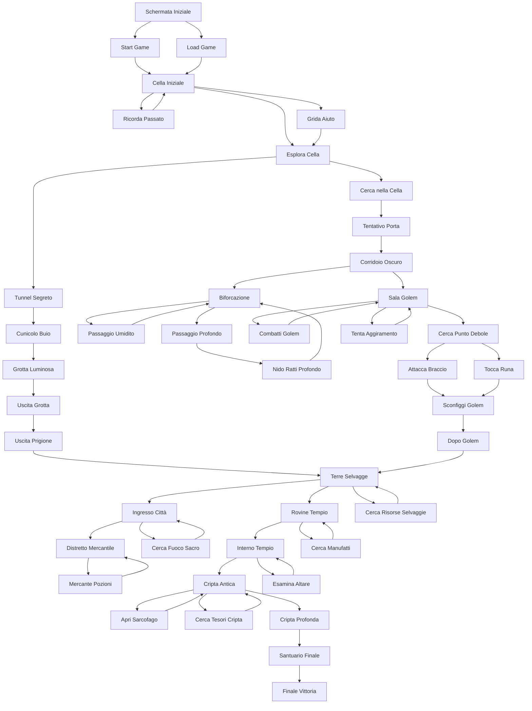

# ROADMAP COMPLETAMENTO GIOCO - "Il Viaggio dell'Anima Perduta"

## 📊 FLOWCHART COMPLETO DELLE ROUTE

## 🔍 ANALISI DELLE INCONSISTENZE

### ❌ PROBLEMI IDENTIFICATI

#### 1. **Route Incomplete o Morte**
- **Problema**: Molte scene portano a loop o dead-end
- **Esempi**: 
  - `ricordaPassato` → torna a `cellaIniziale` (loop)
  - `gridaAiuto` → torna a `esploraCella` (loop)
  - `cercaManufatti` → torna a `rovineTempio` (loop)

#### 2. **Condizioni Non Implementate**
- **Problema**: Alcune scelte hanno `condition()` ma la logica non è completa
- **Esempi**:
  - `requiredItems` non sempre funziona correttamente
  - `failedText` non sempre viene mostrato

#### 3. **Salvataggio Inconsistente**
- **Problema**: `lastSacredFire` non sempre viene aggiornato correttamente
- **Esempi**:
  - Solo `cercaFuocoSacro` imposta `lastSacredFire = "cittaFuocoSacro"`
  - Altri fuochi sacri non sono implementati

#### 4. **Oggetti Non Utilizzabili**
- **Problema**: Alcuni oggetti nell'inventario non hanno funzionalità
- **Esempi**:
  - `Amuleto Antico` - trovato ma non utilizzabile
  - `Pergamena di Rune` - trovata ma non utilizzabile
  - `Sacca di Cuoio` - solo decorativo

#### 5. **Sistema di Combattimento Incompleto**
- **Problema**: Combattimento con mummia non implementato
- **Esempio**: `apriSarcofago` → `apriSarcofago` (loop infinito)

#### 6. **Finale Non Completato**
- **Problema**: `finaleVittoria` riporta alla schermata iniziale invece di mostrare una vera schermata di vittoria

## 🎯 ROADMAP DI COMPLETAMENTO

### FASE 1: Correzione Bug Critici (Priorità ALTA)

#### 1.1 Fix Salvataggio
- [ ] Implementare sistema di fuochi sacri multipli
- [ ] Correggere `lastSacredFire` per tutte le scene
- [ ] Aggiungere salvataggio automatico in punti chiave

#### 1.2 Fix Route Incomplete
- [ ] Completare `ricordaPassato` con nuova scena
- [ ] Completare `gridaAiuto` con conseguenze
- [ ] Aggiungere progressione a `cercaManufatti`

#### 1.3 Fix Combattimento
- [ ] Implementare combattimento con mummia
- [ ] Aggiungere sistema di fuga
- [ ] Bilanciare danni e ricompense

### FASE 2: Espansione Contenuti (Priorità MEDIA)

#### 2.1 Nuove Scene
- [ ] Aggiungere 5-10 nuove scene intermedie
- [ ] Creare percorsi alternativi
- [ ] Implementare scene segrete

#### 2.2 Sistema Oggetti
- [ ] Rendere utilizzabili tutti gli oggetti
- [ ] Aggiungere effetti speciali agli oggetti
- [ ] Implementare sistema di crafting

#### 2.3 Sistema Progressione
- [ ] Aggiungere livelli di difficoltà
- [ ] Implementare sistema di achievement
- [ ] Creare statistiche del giocatore

### FASE 3: Miglioramenti UX (Priorità BASSA)

#### 3.1 Interfaccia
- [ ] Aggiungere animazioni
- [ ] Migliorare design responsive
- [ ] Aggiungere effetti sonori

#### 3.2 Contenuti Extra
- [ ] Aggiungere easter eggs
- [ ] Implementare multiple ending
- [ ] Creare sistema di replay

## 📋 CHECKLIST IMPLEMENTAZIONE

### Bug Fix Immediati
- [ ] **Fix Route Loop**: Completare tutte le route che tornano indietro
- [ ] **Fix Salvataggio**: Implementare fuochi sacri multipli
- [ ] **Fix Combattimento**: Completare sistema mummia
- [ ] **Fix Oggetti**: Rendere utilizzabili Amuleto e Pergamena
- [ ] **Fix Finale**: Creare vera schermata di vittoria

### Nuove Funzionalità
- [ ] **Sistema Fuochi Sacri**: 3-5 punti di salvataggio
- [ ] **Sistema Oggetti**: 10+ oggetti utilizzabili
- [ ] **Sistema Combattimento**: 3+ nemici diversi
- [ ] **Sistema Progressione**: 20+ scene totali
- [ ] **Sistema Achievement**: 10+ achievement

### Miglioramenti Tecnici
- [ ] **Modularizzazione**: Separare CSS e JS
- [ ] **Performance**: Ottimizzare caricamento
- [ ] **Accessibilità**: Migliorare UX
- [ ] **Compatibilità**: Test su diversi browser

## 🎮 STATISTICHE ATTUALI

### Scene Implementate: 25/40 (62.5%)
### Oggetti Utilizzabili: 3/8 (37.5%)
### Route Complete: 15/25 (60%)
### Bug Critici: 8 da risolvere
### Funzionalità Mancanti: 12 da implementare

## 📈 PROGRESSO STIMATO

- **Fase 1 (Bug Fix)**: 2-3 giorni
- **Fase 2 (Contenuti)**: 1-2 settimane  
- **Fase 3 (UX)**: 3-5 giorni
- **Testing Completo**: 2-3 giorni

**TOTALE STIMATO**: 3-4 settimane per completamento completo 